# ER-диаграмма базы данных

Сгенерирована из `sql/schema.sql` (39 таблиц, включая служебную
`schema_migrations`). Отражает реальные `PRIMARY KEY`/`REFERENCES` из схемы,
не ORM-модели — рантайм работает через `asyncpg` напрямую (см. ROADMAP.md
§2.2), поэтому эта диаграмма — единственный источник истины о связях таблиц.

Атрибуты в диаграмме сокращены до PK/FK и ключевых бизнес-полей ради
читаемости; полный список колонок, `CHECK`-ограничений и `DEFAULT` — в
`sql/schema.sql`.

Обновлена после раунда исправления схемной просадки между `sql/schema.sql`
и `app/services/*.py` (ROADMAP.md §3.0, Баги №3-№10) — раунд добавил 15
таблиц (в основном теги/история/junction-таблицы, читаемые/наполняемые
сервисным слоем, которых схема раньше не знала вовсе) к 23, что были в
диаграмме исходно.

```mermaid
erDiagram
    USERS ||--o{ USERS : "создаёт (created_by)"
    USERS ||--o{ USER_PERMISSIONS : "имеет"
    USERS ||--o{ API_KEYS : "владеет"
    USERS ||--o{ SESSIONS : "владеет"
    USERS ||--o{ CAMPAIGNS : "создаёт"
    USERS ||--o{ CONTACT_GROUPS : "создаёт"
    USERS ||--o{ CONTACTS : "создаёт"
    USERS ||--o{ CONTACT_NOTES_HISTORY : "пишет заметку"
    USERS ||--o{ CONTACT_IMPORT_JOBS : "запускает"
    USERS ||--o{ SETTINGS : "изменяет"
    USERS ||--o{ AUDIO_FILES : "загружает"
    USERS ||--o{ TTS_JOBS : "запускает"
    USERS ||--o{ AUDIT_LOG : "действует"
    USERS ||--o{ BLACKLIST : "добавляет"
    USERS ||--o{ BLACKLIST_HISTORY : "изменяет запись"
    USERS ||--o{ API_TOKENS : "владеет"
    USERS ||--o{ WEBHOOK_SUBSCRIPTIONS : "создаёт"
    USERS ||--o{ RECORD_VERSIONS : "изменяет"
    USERS ||--o{ NOTIFICATIONS : "получает"
    USERS ||--o{ INCOMING_CALLS : "прослушивает (listened_by)"
    USERS ||--o{ INCOMING_CALL_EVENTS : "действует"

    CONTACT_GROUPS ||--o{ CONTACT_GROUPS : "родитель"
    CONTACT_GROUPS ||--o{ CONTACTS : "основная группа (group_id)"
    CONTACT_GROUPS ||--o{ CONTACT_IMPORT_JOBS : "цель импорта"
    CONTACT_GROUPS ||--o{ CONTACT_GROUP_MEMBERS : "включает"

    CONTACTS ||--o{ CONTACT_GROUP_MEMBERS : "состоит в группах"
    CONTACTS ||--o{ CONTACT_TAGS : "помечен"
    CONTACTS ||--o{ CONTACT_NOTES_HISTORY : "имеет заметки"
    CONTACTS ||--o{ CAMPAIGN_CONTACTS : "включён в"
    CONTACTS ||--o{ CALL_RESULTS : "объект звонка"
    CONTACTS ||--o{ INCOMING_CALLS : "источник (contact_id)"

    CAMPAIGNS ||--o{ CAMPAIGN_TAGS : "помечена"
    CAMPAIGNS ||--o{ CAMPAIGN_SCHEDULES : "расписание"
    CAMPAIGNS ||--o{ CAMPAIGN_CONTACTS : "включает"
    CAMPAIGNS ||--o{ CALL_RESULTS : "порождает"
    CAMPAIGNS ||--o{ AUDIO_FILES : "приветствие для"
    CAMPAIGNS ||--o{ AUDIO_USAGE : "использование аудио в"
    AUDIO_FILES ||--o{ CAMPAIGNS : "используется как audio_id"

    CALL_RESULTS ||--o{ CALL_TAGS : "помечен"
    CALL_RESULTS ||--o{ CALL_EVENTS : "события"
    CALL_RESULTS ||--o{ CALL_TRANSCRIPTIONS : "транскрибация"
    CALL_RESULTS ||--o{ CALL_RECORDINGS : "запись разговора"
    CALL_RESULTS ||--o{ AUDIO_USAGE : "аудио использовано в"

    AUDIO_FILES ||--o{ AUDIO_FILES : "конвертирован из"
    AUDIO_FILES ||--o{ AUDIO_TAGS : "помечен"
    AUDIO_FILES ||--o{ AUDIO_USAGE : "история использования"
    AUDIO_FILES ||--o{ TTS_JOBS : "результат генерации"

    BLACKLIST ||--o{ BLACKLIST_TAGS : "помечена"
    BLACKLIST ||--o{ BLACKLIST_HISTORY : "история изменений"

    WEBHOOK_SUBSCRIPTIONS ||--o{ WEBHOOK_DELIVERIES : "доставки"

    INCOMING_CALLS ||--o{ INCOMING_CALL_TAGS : "помечен"
    INCOMING_CALLS ||--o{ INCOMING_CALL_EVENTS : "события (прослушивания)"

    USERS {
        int id PK
        varchar username UK
        varchar role "admin/manager/operator/viewer/api/auditor"
        varchar status "active/inactive/blocked/pending"
        boolean totp_enabled
        int created_by FK
        timestamp deleted_at
    }

    USER_PERMISSIONS {
        int user_id PK, FK
        varchar permission PK
    }

    API_KEYS {
        int id PK
        int user_id FK
        varchar key_hash UK
        jsonb permissions
        timestamp expires_at
    }

    SESSIONS {
        uuid id PK
        int user_id FK
        boolean is_active
        timestamp expires_at
    }

    CAMPAIGNS {
        int id PK
        varchar name
        varchar priority "low/normal/high/critical"
        varchar status "draft/running/paused/stopped/completed/failed/scheduled"
        int max_calls
        int cps
        varchar dial_mode "predictive/progressive/preview/power"
        int audio_id FK
        jsonb retry_strategy
        jsonb schedule
        int created_by FK
    }

    CAMPAIGN_TAGS {
        int campaign_id PK, FK
        varchar tag PK
    }

    CAMPAIGN_SCHEDULES {
        int id PK
        int campaign_id FK
        varchar schedule_type "once/daily/weekly/monthly/cron"
        int_array days_of_week
        boolean is_active
    }

    CONTACT_GROUPS {
        int id PK
        varchar name UK
        int parent_id FK "самоссылка"
        boolean is_public
        int created_by FK
    }

    CONTACTS {
        int id PK
        varchar phone "нормализован триггером normalize_phone_number()"
        int group_id FK "основная/primary группа"
        varchar status "active/inactive/blocked/blacklisted/error"
        boolean blacklisted
        int total_calls
        boolean dnd
        int created_by FK
        timestamp deleted_at
    }

    CONTACT_GROUP_MEMBERS {
        int contact_id PK, FK
        int group_id PK, FK
        boolean is_primary
    }

    CONTACT_TAGS {
        int contact_id PK, FK
        varchar tag PK
    }

    CONTACT_NOTES_HISTORY {
        int id PK
        int contact_id FK
        text note
        int created_by FK
    }

    CONTACT_IMPORT_JOBS {
        int id PK
        int group_id FK
        varchar status "pending/processing/completed/failed/cancelled"
        int imported_rows
        int created_by FK
    }

    CAMPAIGN_CONTACTS {
        int id PK
        int campaign_id FK
        int contact_id FK
        int retry_count
        timestamp next_retry_at
    }

    CALL_RESULTS {
        int id PK
        int campaign_id FK
        int contact_id FK
        varchar phone
        varchar status
        varchar direction "outbound/inbound"
        varchar dtmf_result
        int duration
        text_array tags
    }

    CALL_TAGS {
        int call_id PK, FK
        varchar tag PK
    }

    CALL_EVENTS {
        int id PK
        int call_id FK
        varchar event_type
        jsonb details
    }

    CALL_TRANSCRIPTIONS {
        int id PK
        int call_id FK
        text transcription
    }

    CALL_RECORDINGS {
        int id PK
        int call_result_id FK
        text file_path
        text transcription
        varchar transcription_status
    }

    SETTINGS {
        varchar key PK
        text value
        varchar category
        int updated_by FK
    }

    AUDIO_FILES {
        int id PK
        varchar name
        text file_path
        double duration
        varchar status "uploading/processing/ready/error/deleted"
        int converted_from_id FK "самоссылка"
        text tts_text
        int campaign_id FK
        int created_by FK
        timestamp deleted_at
    }

    AUDIO_TAGS {
        int audio_id PK, FK
        varchar tag PK
    }

    AUDIO_USAGE {
        int id PK
        int audio_id FK
        int campaign_id FK
        int call_id FK
        timestamp used_at
    }

    TTS_JOBS {
        int id PK
        text text
        varchar status "pending/processing/completed/failed"
        int audio_file_id FK
        int created_by FK
    }

    AUDIT_LOG {
        bigint id PK
        int user_id FK
        varchar action
        varchar severity "debug/info/warning/error/critical"
        varchar entity_type
        int entity_id
        jsonb changes
        varchar correlation_id
    }

    BLACKLIST {
        int id PK
        varchar phone UK
        text reason
        varchar status
        timestamp expires_at
        int created_by FK
        int removed_by FK
    }

    BLACKLIST_TAGS {
        int blacklist_id PK, FK
        varchar tag PK
    }

    BLACKLIST_HISTORY {
        int id PK
        int blacklist_id FK
        varchar action
        int created_by FK
    }

    API_TOKENS {
        int id PK
        int user_id FK
        varchar token UK
        text_array permissions
        timestamp expires_at
    }

    WEBHOOK_EVENTS {
        int id PK
        varchar name UK
        varchar category
        boolean is_active
    }

    WEBHOOK_SUBSCRIPTIONS {
        int id PK
        text url
        text_array events
        int created_by FK
        int consecutive_failures
    }

    WEBHOOK_DELIVERIES {
        bigint id PK
        int subscription_id FK
        varchar status "pending/success/failed/retry/expired"
        int response_code
    }

    RECORD_VERSIONS {
        bigint id PK
        varchar entity_type
        int entity_id
        int version
        jsonb data
        int created_by FK
    }

    NOTIFICATIONS {
        int id PK
        int user_id FK
        varchar type
        boolean is_read
    }

    SYSTEM_EVENTS {
        bigint id PK
        varchar event_type
        varchar severity "debug/info/warning/error/critical"
    }

    INCOMING_CALLS {
        int id PK
        varchar caller_number
        varchar called_number
        text recording_path
        varchar transcription_status "pending/processing/completed/failed"
        varchar status "new/listened/archived/deleted"
        varchar unique_id UK
        int contact_id FK
        int listened_by FK
        boolean listened
    }

    INCOMING_CALL_TAGS {
        int incoming_call_id PK, FK
        varchar tag PK
    }

    INCOMING_CALL_EVENTS {
        int id PK
        int incoming_call_id FK
        varchar event_type
        int user_id FK
        jsonb details
    }
```

## Заметки к диаграмме

- **Теги/история/junction-таблицы, добавленные раундом исправления схемной
  просадки** (`user_permissions`, `api_keys`, `campaign_tags`,
  `contact_group_members`, `contact_tags`, `contact_notes_history`,
  `call_tags`, `call_events`, `call_transcriptions`, `audio_tags`,
  `audio_usage`, `blacklist_tags`, `blacklist_history`,
  `incoming_call_tags`, `incoming_call_events`) в основном следуют одному
  из двух паттернов: **активно используемые** junction/tag-таблицы (composite
  PK `(parent_id, tag)`, `ON DELETE CASCADE` от родителя) — сервис и пишет,
  и читает; и **только читаемые** history/events-таблицы
  (`contact_notes_history`, `call_events`, `call_transcriptions`,
  `audio_usage`, `blacklist_history`, `incoming_call_events`) — сервисный
  код сегодня их только `SELECT`-ит (обычно через метод вида
  `_get_*_history()`), чтобы не падать, если строки когда-нибудь появятся;
  наполнение этих таблиц — отдельная будущая задача, не реализовано ни для
  одной из них на сегодняшний день (см. ROADMAP.md §3.0, Баги №3-№10).
- **`campaign_contacts`** имеет составное `UNIQUE(campaign_id, contact_id)`
  (`sql/schema.sql`) — контакт может быть включён в конкретную кампанию
  только один раз; Mermaid ER-диаграммы не поддерживают отображение
  составных `UNIQUE`-ограничений как отдельного элемента, поэтому оно не
  показано на схеме напрямую.
- **`campaigns.audio_id → audio_files.id`** объявлен не в `CREATE TABLE
  campaigns`, а отдельным `ALTER TABLE ... ADD CONSTRAINT fk_campaigns_audio`
  после создания `audio_files` (см. `sql/schema.sql`) — единственный
  способ разорвать циклическую зависимость `campaigns → audio_files →
  campaigns` (у `audio_files` тоже есть `campaign_id → campaigns.id`).
  На диаграмме это две отдельные стрелки между `CAMPAIGNS` и `AUDIO_FILES`
  в разные стороны, что и отражает реальный двунаправленный FK.
- **`record_versions`** и **`audit_log`** не имеют `FOREIGN KEY` на таблицу,
  которую версионируют/аудируют — `entity_type`/`entity_id` полиморфны
  (могут указывать на `campaigns`, `contacts`, `users` и т.д.), поэтому на
  диаграмме показана только их связь с `users` (кто внёс изменение), а не с
  версионируемой сущностью — Postgres не поддерживает полиморфный FK. То же
  верно для `call_events`/`incoming_call_events` — `event_type` свободная
  строка, не enum и не FK.
- **`settings`** — единственная таблица с непервичным `id`: PK — `key`
  (VARCHAR), поэтому она сознательно исключена из `create_record_version()`
  (см. комментарий в `sql/schema.sql` и ROADMAP.md §1.1, критичный баг №8)
  и не участвует в цепочке версионирования.
- **`system_events`** — единственная таблица без исходящих FK на `users`;
  системные события не привязаны к конкретному пользователю по дизайну.
  `incoming_calls`, ранее тоже входившая в этот список, с Баг №9 (ROADMAP.md
  §3.0) получила `listened_by → users.id` — прослушавший запись пользователь
  теперь отслеживается.
- Нормализация номера (`8`→`7`, голый `9XXXXXXXXX`→`79XXXXXXXXX`) происходит
  **дважды**: на уровне API (`app/utils/phone.py`, см. ROADMAP.md §3.9) и
  повторно на уровне БД триггером `normalize_phone_number()`
  (`sql/schema.sql`) — та же логика продублирована в SQL, потому что
  таблицу `contacts` можно наполнять и в обход API (`COPY`, прямые вставки
  при миграции данных), и в этом случае номер всё равно должен прийти к
  единому виду перед тем, как триггер `check_blacklist()` сверит его со
  списком заблокированных номеров.

5 представлений (`campaign_stats`, `daily_stats`, `active_campaigns`,
`dial_queue_view`, `dashboard_summary`) не показаны как отдельные сущности —
это агрегирующие `SELECT`-запросы поверх таблиц выше, не хранящие
собственных данных; их определения — в `sql/schema.sql`.
