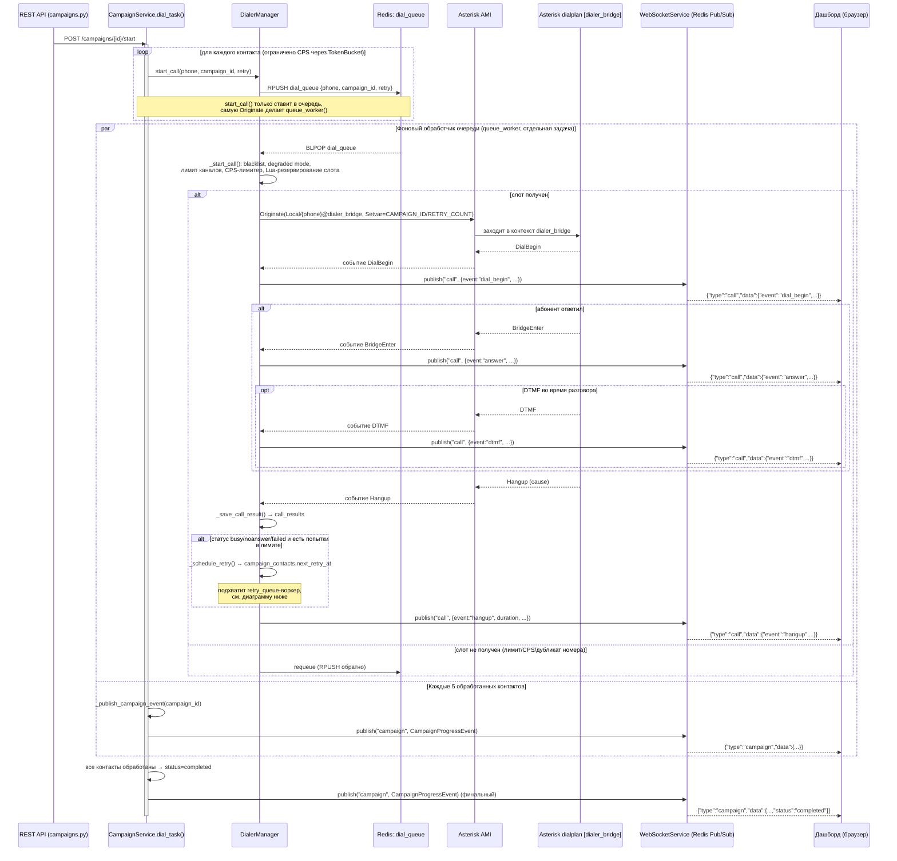
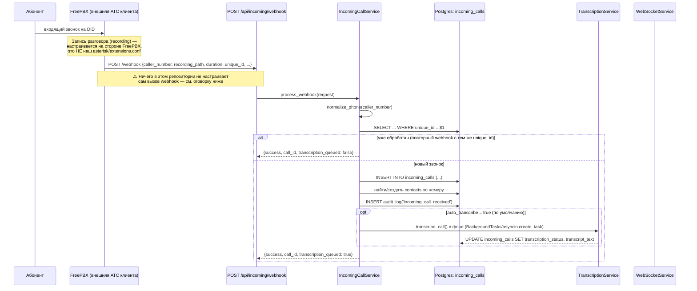
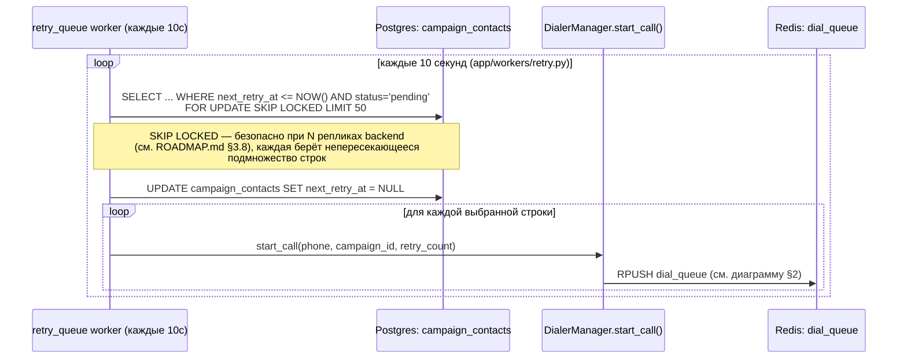

# WebSocket-события и диаграммы последовательности (ROADMAP.md §3.1)

Дополняет `docs/ER_DIAGRAM.md` (схема БД) и автосгенерированный `/docs`
(Swagger/OpenAPI — все REST-эндпоинты уже описаны там из коробки через
FastAPI, отдельно не дублируются здесь). Этот документ закрывает то, что
`/docs` не показывает: контракт WebSocket-событий в одном месте и как
реально выглядит поток исходящего/входящего звонка по коду, а не по ТЗ.

Построено чтением кода (`app/services/dialer.py`, `campaign.py`,
`incoming.py`, `websocket.py`, `app/api/websocket.py`,
`frontend/dist/js/system.js`), а не по памяти — там, где код и
предположение из ТЗ разошлись, ниже явно указано.

---

## 1. WebSocket-события

### 1.1 Подключение

Единственный эндпоинт: `WS /api/ws/dashboard?token=<JWT>` (`app/api/websocket.py`).

- Токен передаётся query-параметром, а не заголовком `Authorization` —
  браузерный WebSocket API не даёт установить произвольные заголовки при
  хендшейке.
- Невалидный/отсутствующий токен **не отклоняет соединение** — оно
  принимается в анонимном режиме (`user_id=None`) и получает все
  публичные события (`call`/`campaign`/`system`), кроме персональных
  `notification`, адресованных конкретному `user_id`
  (`WebSocketService.send_personal()`).
- Сразу после подключения сервер сам отправляет один снимок статуса:
  `{"type": "system", "data": <HealthCheckResponse-подобный статус>}` —
  чтобы дашборд не ждал следующего события, если система давно не меняла
  состояние.
- После этого клиент только держит соединение (`websocket.receive_text()`
  в цикле); вся полезная нагрузка идёт от сервера. Ping/pong клиента не
  обрабатывается предметно, только не даёт таймаута транспорта.

### 1.2 Общий конверт

Все сообщения — единый JSON-конверт:

```json
{"type": "call" | "campaign" | "system" | "notification", "data": {...}}
```

`data` — сериализованная (`model_dump(mode="json")` или dict вручную)
Pydantic-модель из `app/models/system.py`, кроме `notification`, у
которой ad-hoc словарь (см. ниже).

### 1.3 Транспорт: Redis Pub/Sub, не прямая рассылка

Приложение может работать в нескольких процессах (несколько
gunicorn/uvicorn воркеров) — WebSocket-соединение живёт только в одном
процессе, но событие может родиться в другом (дозвонщик, фоновый воркер).
Поэтому публикация всегда идёт в два шага:

1. Источник события (`DialerManager`, `CampaignService`,
   `NotificationService`) публикует JSON в канал Redis
   `REDIS_KEYS.WS_CHANNELS:<call|campaign|system|notification>`.
2. Каждый процесс с активным `WebSocketService` подписан на все 4 канала
   (`WebSocketService.start()`) и при получении сообщения рассылает его
   всем **своим локальным** соединениям (`_broadcast_local`).

Значит любое из событий ниже долетит до дашборда независимо от того, в
каком процессе/воркере оно было сгенерировано.

### 1.4 Справочник событий

| `type` | Модель (`app/models/system.py`) | Кто публикует | Когда |
|---|---|---|---|
| `call` | `LiveCallEvent` | `DialerManager._publish_call_event()` (`dialer.py`) | На каждое AMI-событие звонка — `dial_begin` (Originate прошёл), `answer` (BridgeEnter), `hangup`, `dtmf` |
| `campaign` | `CampaignProgressEvent` | `CampaignService._publish_campaign_event()` (`campaign.py`) | Раз в 5 обработанных контактов внутри `dial_task()`, плюс всегда при завершении/остановке/ошибке кампании |
| `system` | `SystemNotificationEvent` | `DialerManager._publish_system_event()` (`dialer.py`) | Подключение/потеря AMI (`ensure_connected()`/`health_check()`); также разово при первом подключении клиента сервер шлёт снимок статуса напрямую, не через этот канал |
| `notification` | ad-hoc `{id, user_id, type, title, message}` | `NotificationService.create()` (`notification.py`) | При создании персонального уведомления пользователю; в `WebSocketService.send_personal()` фильтруется по `user_id` **только в рамках текущего процесса** — см. оговорку ниже |

**`event` внутри `LiveCallEvent`** (поле `event`, не путать с `type`
конверта): `dial_begin` | `answer` | `hangup` | `dtmf`. Общие поля —
`unique_id`, `linked_id`, `campaign_id`, `phone`, `status` (причина
hangup), `dtmf` (нажатая цифра), `duration` (только на `hangup`, если
звонок был отвечен).

### 1.5 Как это использует фронтенд

`frontend/dist/js/system.js: handleWebSocketMessage()` — единственная
точка входа, диспетчеризует по `data.type`:

- `call` → `handleCallEvent()` — обновляет счётчик активных звонков/список
  живых звонков на дашборде.
- `system` → обновляет индикатор статуса AMI/SIP.
- `notification` → `App.showToast(data.data.message, 'info')`, если
  `data.data.message` присутствует.
- `campaign` → делегируется в `App.campaigns.handleCampaignEvent()`
  (`campaigns.js`): точечно обновляет строку таблицы кампаний, и если
  открыта модалка деталей именно этой кампании — перезапрашивает её через
  REST (`CampaignProgressEvent` не несёт полной статистики
  busy/noanswer/failed, только то, что нужно для строки таблицы).

### 1.6 Известная оговорка: `notification` и несколько процессов

`send_personal()` фильтрует локальные соединения по `user_id`, но
рассылка всё равно проходит через Redis Pub/Sub-подписку каждого
процесса на канал `...:notification` → в проде с несколькими
gunicorn/uvicorn воркерами **каждый** процесс получит сообщение из Redis
и попытается разослать его своим локальным соединениям; фактически до
пользователя долетит одна копия — та, что от процесса, где реально живёт
его WebSocket-соединение, — но остальные процессы тоже потратят цикл на
JSON-парсинг и пустой перебор `_connection_users`. Не баг (результат
корректный, лишняя работа — O(число процессов) на уведомление, не
O(число пользователей)), но стоит знать при отладке нагрузки на
`notification`-канал в многопроцессном деплое.

---

## 2. Диаграмма: исходящий звонок (кампания)



**Важные детали, которые легко упустить при беглом чтении ТЗ:**

- `start_call()` не звонит напрямую — это постановка в Redis-очередь
  `dial_queue`; реальный `Originate` делает отдельная фоновая задача
  `queue_worker()`. Это разделение даёт возможность троттлить исходящие
  вызовы (CPS-лимитер, лимит каналов) независимо от скорости, с которой
  `dial_task()` перебирает контакты кампании.
- Резервирование слота в `active_channels` — атомарный Lua-скрипт в
  Redis (`RESERVE_WITH_RESERVATION_LUA`), не read-then-write — иначе два
  параллельных вызова `_start_call()` могли бы одновременно пройти
  проверку лимита и превысить `max_calls`.
- `retry_queue`-воркер (см. §3.8 ROADMAP.md) не участвует в этой
  диаграмме напрямую — он отдельно, раз в 10с, вычитывает
  `campaign_contacts` с истёкшим `next_retry_at` через
  `FOR UPDATE SKIP LOCKED` и заново вызывает `dialer_service.start_call()`
  — с точки зрения диаграммы выше это просто ещё один источник, кладущий
  задачу в тот же `dial_queue`.

---

## 3. Диаграмма: входящий звонок



**Важная находка при построении этой диаграммы (не задокументирована
нигде раньше):** в `asterisk/extensions.conf` этого репозитория **нет**
контекста, который принимает входящий звонок, пишет запись и сам дёргает
`POST /api/incoming/webhook` — там есть только `[sub-record]` (используется
для записи **исходящих** дозвонных звонков через `Gosub` из
`dialer_bridge`) и `[default]`/`[test]`. Это согласуется с архитектурой
из §2.4 ROADMAP.md: **наш** Asterisk — только для AMI/исходящего обзвона
и регистрируется SIP-клиентом на внешней FreePBX; входящие звонки
физически принимает FreePBX клиента, не этот Asterisk. Значит вызов
`/api/incoming/webhook` после записи звонка должен быть настроен
**на стороне FreePBX** (например, dialplan-макрос с `curl`/AGI-скриптом
после `Record()`/`MixMonitor()`) — это конфигурация внешней системы,
которой в этом репозитории нет и не может быть, но которую нужно явно
прописать в процессе внедрения у клиента. Сам эндпоинт и вся обработка
на стороне backend — рабочие и покрыты интеграционным путём (см.
`app/api/incoming.py`, `IncomingCallWebhookRequest`), просто ничего его
не вызывает автоматически без этой внешней настройки.

---

## 4. Диаграмма: очередь повторных звонков (retry)



`next_retry_at` выставляется в `DialerManager._schedule_retry()` (см.
диаграмму §2, ветка `hangup`) на основе причины: `busy` (до 2 попыток,
задержка `RETRY_BUSY_DELAY`), `noanswer` (до 3, `RETRY_NOANSWER_DELAY`),
`failed`/`timeout` (до 1, `RETRY_FAILED_DELAY`/60с) — с джиттером
(`random.expovariate`), чтобы повторные попытки по многим номерам не
били одним залпом в одну секунду.
